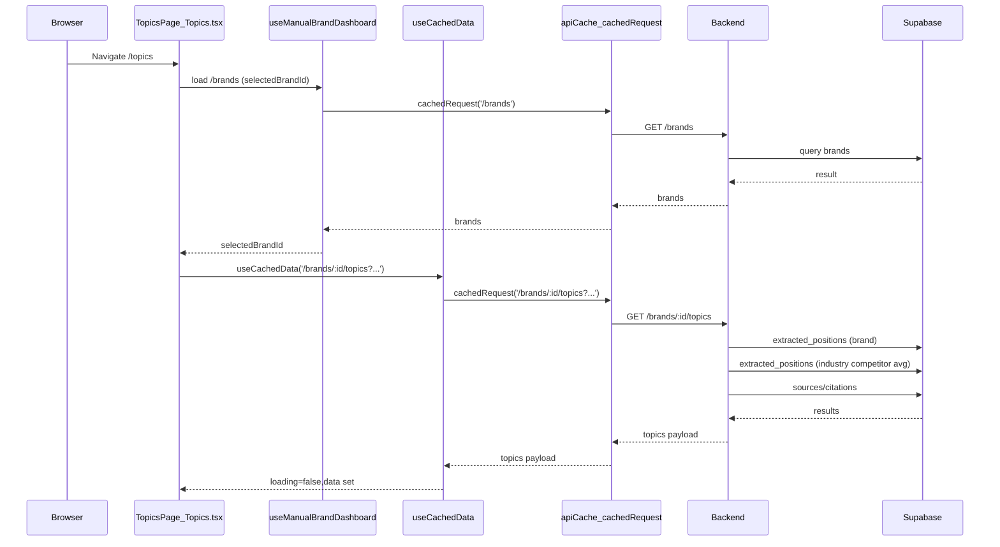

<!-- 5b12f0a7-1710-43ec-9197-14837693bc3f 7a58b5f5-5074-40e6-b013-ca489169eee7 -->
# Debug plan: slow/stuck /topics

## What caching are we using?

- **Frontend caching is in-memory + localStorage (browser), not Redis**.
  - See [`documentation/CACHING_SYSTEM.md`](documentation/CACHING_SYSTEM.md) (explicitly: “client-side only”).
  - Cache implementation: [`src/lib/cacheManager.ts`](src/lib/cacheManager.ts) stores entries under the `evidently_cache_` prefix in `localStorage`.
  - Cached request wrapper: [`src/lib/apiCache.ts`](src/lib/apiCache.ts) applies TTL/stale-while-revalidate and sets `/topics` to `persist: true`.

## Likely causes (ranked) + how to confirm quickly

### A) Backend endpoint is slow/hanging

**Symptom**: Network tab shows `/api/brands/:id/topics` taking many seconds or staying “(pending)”.

- **Most likely hot spot**: competitor-average computation loads a lot of rows.
  - [`backend/src/services/brand.service.ts`](backend/src/services/brand.service.ts) → `getBrandTopicsWithAnalytics()` calls `getIndustryAvgSoAPerTopic()`.
  - `getIndustryAvgSoAPerTopic()` currently queries **all `extracted_positions` for the customer in the date range** and filters in JS (see the `.from('extracted_positions')...eq('customer_id')...gte/lte('processed_at')` query).
- **Also possible**: `getTopSourcesPerTopic()` does expensive citation/source aggregation.

**Checks**

- In Chrome DevTools → **Network**:
  - Filter `brands`/`topics`/`competitors` and confirm which request dominates.
  - If stuck: confirm whether the request is **pending** vs returning an **error** (401/500).
- On backend logs, add temporary timing (future step) around:
  - generated_queries fetch
  - extracted_positions fetch (brand)
  - getTopSourcesPerTopic
  - getIndustryAvgSoAPerTopic

### B) Brands load is hanging, blocking topics fetch

**Symptom**: `/topics` never requests `/brands/:id/topics` because `brandsLoading` stays true.

- [`src/manual-dashboard/useManualBrandDashboard.ts`](src/manual-dashboard/useManualBrandDashboard.ts) fetches `/brands` using `cachedRequest` **without an AbortController/timeout**. If that fetch hangs, `isLoading` can remain true.

**Checks**

- Network tab: does `/api/brands` hang/pending?
- Console: any auth refresh / 401 loops?

### C) A request is “deduped” forever due to a never-resolving fetch

**Symptom**: sometimes gets stuck, and subsequent navigations stay stuck.

- [`src/lib/cacheManager.ts`](src/lib/cacheManager.ts) dedupes via `pendingRequests`. If the underlying fetch promise never settles, future calls reuse that pending promise.

**Checks**

- Network tab: confirm a request remains pending indefinitely.
- Reload with backend restarted; see if it clears the symptom.

### D) Frontend heavy compute / logging slows render

**Symptom**: Network returns quickly, but UI still takes long to paint.

- [`src/pages/Topics.tsx`](src/pages/Topics.tsx) does transformation + sorting + multiple `console.log` calls inside loops.

**Checks**

- Chrome Performance profiler: long JS task after network completes.
- Temporarily disable verbose logs (future step) and compare.

### E) Cache not giving “instant” render on navigation

**Symptom**: even with cached entries present, the page still shows initial skeleton each time.

- `useCachedData` does an initial cache lookup using a cache key that **does not include `customer_id`**, while [`src/lib/apiCache.ts`](src/lib/apiCache.ts) cache keys *may* include `customer=...`.
  - This can cause a cache miss during initial state, resulting in a brief loading state even if `cachedRequest` later hits cache.

**Checks**

- Inspect `localStorage` entries with prefix `evidently_cache_` and compare keys to the computed key pattern.
- Enable cache debug logs via `VITE_CACHE_DEBUG=true` and watch for cache hit/miss messages.

## Step-by-step debug workflow

### 1) Reproduce with instrumentation (frontend)

- Open `/topics` with DevTools:
  - **Network**: preserve log, disable cache.
  - **Console**: note any errors/warnings.
- Record for the slow/hung case:
  - Which call is slow: `/api/brands`, `/api/brands/:id/topics`, competitor API.
  - Response size/time-to-first-byte.

### 2) Separate “stuck loading state” vs “slow backend”

- If **network is slow** → go backend-first.
- If **network is fast** but UI is slow → go frontend render/calc.
- If **network is pending forever** → focus on fetch timeouts + pending-request dedupe.

### 3) Backend deep-dive (if `/topics` is slow)

- Add timing logs around the major steps in `getBrandTopicsWithAnalytics()`.
- Validate how many rows are being pulled for competitor averages.
- Run SQL-level analysis (EXPLAIN) on `extracted_positions` queries; confirm indexes on:
  - `(customer_id, processed_at)`
  - `(brand_id, customer_id, processed_at)`
  - any fields used for topic extraction/filters.

### 4) Quick mitigations to test (controlled experiments)

- Hit the endpoint with a narrower date range (e.g., 7 days) and compare latency.
- Compare with competitor-average computation temporarily disabled (feature flag / short-circuit) to isolate the hotspot.
- Add a server-side timeout / pagination guard to prevent “infinite pending”.

### 5) Frontend deep-dive (if UI is slow)

- Profile React render on `/topics`.
- Confirm `useCachedData` is not repeatedly re-fetching due to endpoint churn.
- Reduce console logging in hot loops and re-measure.

## Data-flow map (where it can hang)

## What we’ll likely change once we’ve pinpointed the bottleneck

- **If backend is the cause**: rewrite competitor-average computation to be **SQL-aggregated and topic-filtered** (not “load all rows then filter in JS”), and add proper indexes.
- **If frontend is the cause**: add fetch timeouts + better error surfacing for “pending forever”, reduce hot-loop logging, and align `useCachedData`’s initial cache-key logic with `apiCache`’s customer-scoped keys.

### To-dos

- [ ] Confirm caching is client-side (localStorage+memory) and identify where `/topics` is cached (files: src/lib/cacheManager.ts, src/lib/apiCache.ts).
- [ ] Use DevTools Network to determine whether /brands, /brands/:id/topics, or competitor endpoints are the bottleneck; capture stuck vs slow cases.
- [ ] If /topics is slow: instrument backend timings around getBrandTopicsWithAnalytics, especially getIndustryAvgSoAPerTopic and getTopSourcesPerTopic; estimate row counts and query costs.
- [ ] If requests hang: validate pending-request dedupe behavior; add timeout/abort strategy and improve error handling so UI can recover instead of staying in skeleton.
- [ ] Verify cached entries are being used on mount; if not, align useCachedData initial cache-keying with apiCache’s customer-scoped keys to avoid unnecessary initial loading.