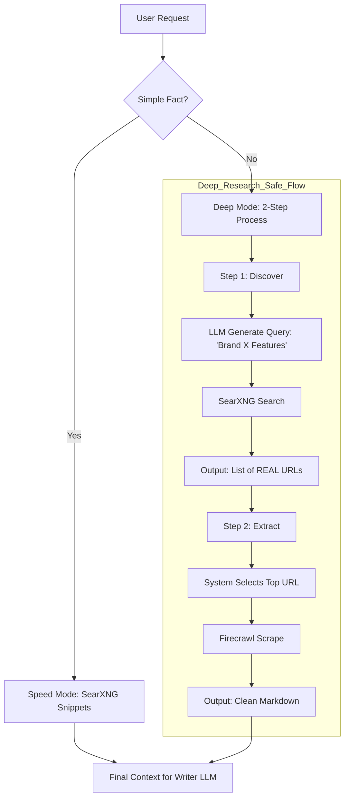

# Self-Hosted MCP Search Implementation Plan

This document outlines the strategy for moving from paid search APIs to a self-hosted, containerized search stack on our VPS using the Model Context Protocol (MCP).

## 🚀 Recommended Architecture: SearXNG + MCP Bridge

To achieve reliable, "no-fee" web search and data extraction, we will deploy a **Discovery + Extraction** stack:
1. **SearXNG**: To find relevant URLs across the web.
2. **Speed Mode**: Use SearXNG snippets directly (sub-2s latency).
3. **Deep Mode**: Use Firecrawl to convert URLs into Markdown (high quality).

### Why SearXNG?
- **Privacy & Sovereignty**: You own the data and the queries.
- **Aggregation**: Queries 70+ search engines (Google, Bing, DuckDuckGo, etc.) simultaneously.
- **No API Fees**: It scrapes public results or uses free endpoints, acting as a "human" browser.
- **Resilience**: Automatically handles rotating between engines if one is slow or blocked.

---

## 🛠️ Step 1: VPS Deployment (Docker Compose)

We will use a multi-container setup to ensure performance and portability.

### `docker-compose.yml`
```yaml
services:
  # 1. SearXNG: The core search engine
  searxng:
    image: searxng/searxng:latest
    container_name: searxng
    restart: always
    volumes:
      - ./searxng:/etc/searxng:ro
    environment:
      - SEARXNG_BASE_URL=http://localhost:8080/
    ports:
      - "8080:8080"
    cap_drop:
      - ALL
    cap_add:
      - CHOWN
      - SETGID
      - SETUID
    logging:
      driver: "json-file"
      options:
        max-size: "10m"
        max-file: "3"

  # 2. Redis: Required by SearXNG for result caching and performance
  redis:
    image: redis:alpine
    container_name: searxng-redis
    restart: always
    command: redis-server --save 60 1 --loglevel warning

  # 3. Firecrawl: Deep Extraction Engine (Optional but Recommended)
  # Converts URLs into clean Markdown for the LLM
  firecrawl:
    image: firecrawl/firecrawl:latest
    container_name: firecrawl
    environment:
      - REDIS_URL=redis://searxng-redis:6379
      - PLAYWRIGHT_MICROSERVICE_URL=http://playwright:3000
    depends_on:
      - redis

  # 4. MCP Multi-Bridge: Exposes both search and extraction
  mcp-bridge:
    image: node:18-slim
    container_name: mcp-bridge
    environment:
      - SEARXNG_URL=http://searxng:8080
      - FIRECRAWL_URL=http://firecrawl:3002
      # The Bridge defines two tools: 'quick_search' and 'deep_research'

---

## 🛠️ Alternative: Direct API (No MCP)

If you prefer a **leaner** setup without the MCP Bridge container, you can perform "Direct Integration" in your backend code.

### Architecture Change
- **Remove**: `mcp-bridge` container.
- **Update**: `docker-compose.yml` to only run `searxng`, `redis`, and `firecrawl`.

### Implementation
1. **Quick Search**:
   - URL: `http://localhost:8080/search?q={query}&format=json`
   - Code: Simple `fetch()` call.
   - Response: JSON with `results[{ title, content, url }]`.

2. **Deep Research**:
   - URL: `http://localhost:3002/v0/scrape`
   - Body: `{ "url": "https://brand.com", "formats": ["markdown"] }`
   - Response: JSON with `markdown` field.
```

---

## 🧠 Step 2: The LLM Router Logic

The "Magic" happens in the tool definition. We present **two distinct tools** to the LLM (gpt-oss-20b), and it naturally picks the right one based on the task.

### Tool Definitions
1. **`quick_search(query)`**: "Use this for simple facts, pricing, news, or dates. Returns fast text snippets. (Cost: Low, Speed: Fast)"
2. **`deep_research(url)`**: "Use this ONLY for reading full case studies, technical documentation, or long articles. Returns full Markdown. (Cost: High, Speed: Slow)"

### Example Scenarios
- **Prompt**: "Find the price of tool X."
  - **LLM Decides**: `quick_search("Tool X pricing 2026")` -> **Speed Mode** (SearXNG Snippets)
- **Prompt**: "Analyze the marketing strategy for Brand X."
  - **LLM Decides**: `research_topic("Brand X marketing case study")`
  - **System Action**: 
    1. Calls SearXNG with query.
    2. Extracts **REAL** URLs from results (e.g., `brand.com/blog/case-study`).
    3. Calls Firecrawl on the **verified** URL. -> **Deep Mode**

### 🛡️ Safety Mechanism: No Hallucinated URLs
The LLM **never** inputs a raw URL for deep research. It only inputs a **Topic**.
- The **System** (SearXNG) provides the URLs.
- The **LLM** selects from the list of *actual* search results.

## 📊 Research Flow Diagram



---

## 📝 Step 3: Prompt Engineering (Context Usage)

We must explicitly instruct the Writer LLM (Phase 2) on **HOW** to use this new data.

### The "Grounding" System Prompt
We append this to the system prompt when `research_context` is present:

> **Official Research Context:**
> The following data was retrieved from the web (Source: SearXNG/Firecrawl).
> You MUST prioritize this information over your internal training data.
>
> **Usage Rules:**
> 1. **Cite Everything:** If you use a fact from the context, reference the URL in parentheses.
> 2. **No Hallucinations:** If the context contradicts your internal knowledge (e.g., pricing), assume the context is correct (it's newer).
> 3. **Gap Analysis:** If the context is missing a key fact, state "Data not available" rather than guessing.

### Data Injection Format
```json
{
  "context": [
    { "source": "brand.com/pricing", "content": "Pro plan is $29/mo..." },
    { "source": "news.com/review", "content": "The new feature X is buggy..." }
  ]
}
```

---

## 🔍 Step 2: Selecting the MCP Servers

| Tier | Components | Best For | Latency |
| :--- | :--- | :--- | :--- |
| **Speed Mode** | `mcp-searxng` | Quick facts, news, pricing from snippets. | **~2s** |
| **Deep Mode** | `mcp-firecrawl` | Detailed case studies, feature lists. | **~15s** |
| **Hybrid** | `mzxrai/mcp-webresearch` | Automated browsing (best of both). | **~8s** |

**Recommendation**: **Option A (SearXNG)**. It provides a more stable long-term solution because SearXNG is specifically designed to handle anti-bot measures across many engines.

---

## 🧠 Step 3: Deep Research Workflow

To maximize the quality for the content-writer LLM (gpt-oss-20b), we will implement a **2-Phase Pipeline**:

### Phase 1: Strategic Researcher
- **Instruction**: LLM analyzes the task and decides if research is needed.
- **Tool Call**: Calls `deep-research` or `searxng-search`.
- **Output**: A structured "Brief" containing verified facts, latest pricing, and competitor URLs.

### Phase 2: Content Creator
- **Input**: The Brief from Phase 1 + Brand Guidelines.
- **Instruction**: Synthesize the facts into the final article in the brand's voice.
- **Benefit**: Separating research from writing prevents the LLM from getting "distracted" and ensures facts are pinned before drafting.

---

## 💻 Step 4: Backend Integration

In our `recommendation-content.service.ts`, we will point the search logic to our local VPS endpoint.

```typescript
// Example integration logic
const searchResult = await mcpClient.execute('searxng_search', {
  query: `site:${brandUrl} ${featureName} pricing 2026`,
  engines: ['google', 'bing', 'brave']
});
```

---

## 📈 Next Steps
1. **Deploy SearXNG** to the VPS in a test container.
2. **Configure `settings.yml`** to enable JSON output (required for the MCP bridge).
3. **Link MCP Bridge** to the backend service.
