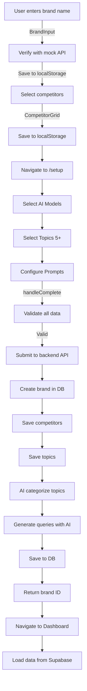

# Onboarding Process - Complete Fix Summary

## 🎯 Issues Fixed

### 1. **BrandInput Component**
- ✅ Now properly saves brand data to `localStorage` immediately after verification
- ✅ Added console logging for debugging
- ✅ Ensures data persists even if user navigates away

### 2. **CompetitorGrid Component**
- ✅ Now saves selected competitors to `localStorage` when user clicks "Continue"
- ✅ Preserves competitor selection data for Setup page

### 3. **Summary Component**
- ✅ Removed broken `submitOnboarding()` call (function doesn't exist)
- ✅ Now ensures brand and competitor data are saved to `localStorage` before proceeding
- ✅ Removed unused import

### 4. **Setup Page**
- ✅ Added comprehensive validation for all required data
- ✅ Enhanced error messages with specific guidance
- ✅ Improved data gathering from `localStorage`
- ✅ Better handling of edge cases (missing fields, wrong data types)
- ✅ Added extensive console logging for debugging
- ✅ Properly maps competitors (handles both objects and strings)
- ✅ Properly maps topics (handles both objects and strings)

### 5. **Backend Services**
- ✅ Brand service properly extracts topic labels from `aeo_topics`
- ✅ Topics are saved to `brand_topics` table
- ✅ AI categorization with triple fallback: Cerebras → OpenAI → Rule-based
- ✅ Query generation with triple fallback: Cerebras → OpenAI → Guided queries
- ✅ Competitors saved to `brand_competitors` table
- ✅ AI models saved to brand `metadata`

## 📊 Complete Onboarding Flow



## 🔍 Data Flow Details

### Frontend → Backend
```typescript
// Data sent from Setup page to backend API
{
  brand_name: "Nike",
  website_url: "https://nike.com",
  description: "Global leader in athletic footwear...",
  industry: "Athletic Apparel",
  competitors: ["Adidas", "Puma", "Under Armour"],
  aeo_topics: [
    { label: "Product Innovation", weight: 1.0 },
    { label: "Pricing & Value", weight: 1.0 },
    { label: "Sustainability", weight: 1.0 },
    // ... more topics
  ],
  ai_models: ["chatgpt", "perplexity", "gemini", "claude"],
  metadata: {
    ceo: "John Donahoe",
    headquarters: "Beaverton, OR",
    founded_year: 1964,
    prompts: ["prompt1", "prompt2"]
  }
}
```

### Backend Processing
1. **Validate data** - Check required fields
2. **Create brand** - Insert into `brands` table
3. **Save competitors** - Insert into `brand_competitors` table
4. **Save topics** - Insert into `brand_topics` table
5. **Categorize topics** - Use Cerebras/OpenAI/Rules to assign categories
6. **Generate queries** - Create neutral queries based on topics
7. **Save queries** - Insert into `query_generations` and `generated_queries` tables
8. **Return success** - Send brand ID back to frontend

### Supabase Tables Populated

| Table | Fields Populated | Source |
|-------|-----------------|--------|
| `brands` | `id`, `customer_id`, `name`, `slug`, `homepage_url`, `industry`, `summary`, `ceo`, `headquarters`, `founded_year`, `metadata` | Setup payload |
| `brand_competitors` | `brand_id`, `competitor_name`, `competitor_url`, `priority` | `competitors` array |
| `brand_topics` | `brand_id`, `topic_name`, `description`, `category` | `aeo_topics` array + AI categorization |
| `onboarding_artifacts` | `customer_id`, `brand_id`, `brand_intel`, `selected_topics` | Complete onboarding data |
| `query_generations` | `brand_id`, `customer_id`, `total_queries`, `locale`, `country`, `strategy` | Query generation metadata |
| `generated_queries` | `generation_id`, `brand_id`, `customer_id`, `query_text`, `intent`, `metadata` | Individual queries |

## 🧪 Testing Checklist

### Step 1: Brand Input
- [ ] Enter a brand name (e.g., "Nike")
- [ ] Wait for verification (2-3 seconds)
- [ ] Check console: Should see "✅ Saving brand data to localStorage"
- [ ] Check localStorage: Should have `onboarding_brand` key
- [ ] Verify brand details are shown (logo, name, industry, etc.)

### Step 2: Competitor Selection
- [ ] See list of competitors for the industry
- [ ] Select 3-10 competitors
- [ ] Click "Continue"
- [ ] Check console: Should see "✅ Saving competitors to localStorage"
- [ ] Check localStorage: Should have `onboarding_competitors` key

### Step 3: Summary
- [ ] See brand and competitor summary
- [ ] Click "Start Analysis" or "Continue"
- [ ] Check console: Should see "✅ Summary: Ensuring brand and competitors are saved"
- [ ] Should navigate to /setup automatically

### Step 4: Setup - AI Models
- [ ] Select at least 1 AI model (ChatGPT, Perplexity, etc.)
- [ ] Click "Next"
- [ ] Should not show error

### Step 5: Setup - Topics
- [ ] Select at least 5 topics from the list
- [ ] Topics should have labels like "Product Innovation", "Pricing & Value", etc.
- [ ] Click "Next"

### Step 6: Setup - Prompts
- [ ] Select at least 1 prompt
- [ ] Click "Complete Setup"
- [ ] Should see loading state: "Setting up your brand..."

### Step 7: Backend Submission
**Check browser console for these logs:**
- [ ] `📦 Raw data from localStorage` - Shows data was found
- [ ] `✅ Brand data parsed` - Brand object is valid
- [ ] `✅ Competitors parsed: X competitors` - Competitors array is valid
- [ ] `📦 Gathering onboarding data` - Shows all data summary
- [ ] `🚀 Submitting complete onboarding data to API` - Shows payload
- [ ] `📥 Response from API` - Shows backend response
- [ ] `✅ Onboarding completed successfully!` - Success message
- [ ] `✅ Saving brand ID to localStorage` - Brand ID saved
- [ ] `✅ Navigating to dashboard...` - Redirect triggered

**Check backend console for these logs:**
- [ ] `✅ Inserted X topics for brand Y`
- [ ] `🤖 Starting AI categorization for X topics`
- [ ] `🚀 Triggering query generation for X topics`
- [ ] `✅ Query generation completed for brand Y`

### Step 8: Dashboard
- [ ] Dashboard should load without errors
- [ ] Dashboard should fetch brands from Supabase (not localStorage)
- [ ] Should see real brand data (not mock data)
- [ ] Check Network tab: Should see API calls to `/brands` and `/brands/:id/dashboard`

## 🐛 Common Issues & Solutions

### Issue: "Brand data not found"
**Solution:** Go back to brand input step and ensure you complete verification. Check localStorage for `onboarding_brand` key.

### Issue: "Cerebras API not returning results"
**Solution:** This is OK! The system has automatic fallbacks:
1. Cerebras API (if configured)
2. OpenAI API (if configured)
3. Guided queries (always works)

The queries will still be generated and saved even without API keys.

### Issue: "Supabase not being populated"
**Check:**
1. Backend server is running (`npm run dev` in backend folder)
2. Backend environment variables are set (`.env` file exists)
3. Supabase credentials are correct
4. Check backend console for error messages
5. Check Network tab in browser DevTools for API errors

### Issue: "Dashboard shows no data"
**Check:**
1. Brand was created successfully (check `brands` table in Supabase)
2. Brand ID was saved to localStorage (`current_brand_id` key)
3. Dashboard is fetching from `/brands` endpoint (check Network tab)
4. User is authenticated (check `Authorization` header in requests)

## 🔧 Environment Setup

### Backend `.env` Requirements
```env
# Required
SUPABASE_URL=your_supabase_url
SUPABASE_SERVICE_ROLE_KEY=your_service_role_key
JWT_SECRET=your_jwt_secret
PORT=8000

# Optional (for enhanced query generation)
CEREBRAS_API_KEY=your_cerebras_key  # Primary AI provider
OPENAI_API_KEY=your_openai_key      # Fallback AI provider

# If not set, system will use guided queries (still works!)
```

## ✅ Expected Results After Complete Onboarding

### Supabase Database
```sql
-- Check brand was created
SELECT * FROM brands WHERE name = 'Nike';

-- Check competitors were saved
SELECT * FROM brand_competitors WHERE brand_id = '<brand_id>';

-- Check topics were saved and categorized
SELECT * FROM brand_topics WHERE brand_id = '<brand_id>';

-- Check queries were generated
SELECT * FROM query_generations WHERE brand_id = '<brand_id>';
SELECT * FROM generated_queries WHERE brand_id = '<brand_id>';
```

### LocalStorage
```javascript
// Check in browser console
localStorage.getItem('onboarding_brand')      // Should have brand data
localStorage.getItem('onboarding_competitors') // Should have competitors
localStorage.getItem('current_brand_id')       // Should have brand ID
localStorage.getItem('onboarding_complete')    // Should be 'true'
```

## 📝 Important Notes

1. **Mock Data**: Brand verification uses mock data (Nike, Apple, Tesla, etc.). Real API integration can be added later.

2. **Non-Blocking**: Query generation failure does NOT block brand creation. The brand and topics are saved even if queries fail to generate.

3. **Fallback System**: The system has multiple fallback layers to ensure it always works:
   - API Keys: Cerebras → OpenAI → Guided Queries
   - Topic Categorization: Cerebras → OpenAI → Rule-based

4. **Console Logging**: Extensive logging has been added for debugging. Check both browser and backend console.

5. **Error Handling**: All error states now show clear, actionable messages to the user.

## 🚀 Ready to Test!

The onboarding process should now work completely end-to-end:
1. ✅ Frontend collects and saves all data
2. ✅ Setup page validates and submits to backend
3. ✅ Backend creates brand and saves all data to Supabase
4. ✅ Topics are categorized
5. ✅ Queries are generated
6. ✅ Dashboard loads real data from Supabase

**Start testing by navigating to `/` and beginning the onboarding flow!**

